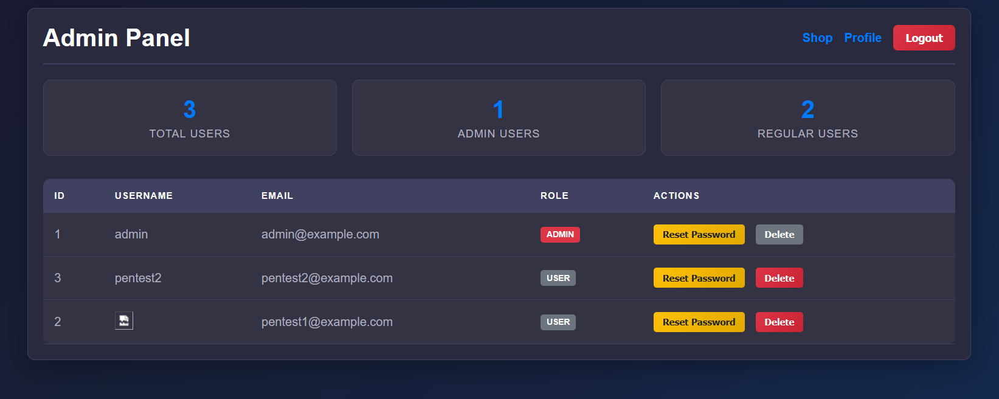

# HDshop

## HDshop ##
- HDshop app exposed at `0.0.0.0:3000`
  - Express.js (node.js) backend
  - AngularJS frontend
  - PostgreSQL at `172.20.0.30:5432`
  - Swagger UI accessible at `/api-docs` (does not include the file upload API endpoints `GET and POST /api/user/<ID>/image` and `POST /api/user/<ID>/image/fetch-url`)
  - `access.log` can be found in docker volume `hdapp_app_logs` (or use the log monitor app)
- Docker-compose included to easily start and stop everything
  - `docker-compose up -d`
- Default credentials (you can create more accounts):
  - pentest1:password
  - pentest2:password
    
## Log Monitor ##
- Log monitor application at `172.20.0.20:80`. Used for logging of activity on HDshop app (also used for SSRF).
  - Includes 2 API endpoints:
    - /api/logs
    - /api/health
  - If you don't care about the SSRF and only want to use it for logging you can expose it on `0.0.0.0` by removing `127.0.0.1` from the docker-compose file (or use it with the SSRF, reboot (logs are persisted) after CTF and remove `127.0.0.1`)
- Logging flow
  - logs-viewer API > `GET /api/logs` every 10 seconds if auto-fresh is enabled (also includes search and exclude parameter)
  - fetches from hdshop-app API > `GET /api/access-logs`
  - `GET /api/access-logs` > reads from `/hdshop-app/logs/access.log`

## Includes the following vulnerabilities and misconfigurations:

- 🚫 **No HTTPS**
- 🔎 **Username Enumeration** in login and registration functions
- 💣 **SQL Injection**  
  - Affects: `login` > `username` field
  - Possible to bypass authentication with `pentest1' OR 1=1--`
  - Stacked queries > for example `"username":"admin' ;SELECT PG_SLEEP(5)--"`
  - boolean-based blind
  - error-based
  - time-based blind
- 🕒 **No login rate limit**
- 🍪 **Session Cookie Missing Flags**
  - Missing `HttpOnly` and `Secure` and `SameSite` attributes
- 🛡️ **Missing all Security Headers**
  - No Content Security Policy
  - No HTTP Strict Transport Security (HSTS)
  - No Referrer header
  - No Permission Policy
  - No X-Frame-Options
  - No X-Content-Type-Options
  - X-Powered-By header discloses tech
- 🦠 **XSS - Stored Cross-Site Scripting**
  - Vector: `username` via create user or update user settings
  - Reflects 2x on shop page and 1x in the admin panel
- 🦠 **XSS - Reflected Cross-Site Scripting**
   - Any mistyped path/file leads to `error.html` which reflects a user controlled `ErrorMessage` parameter > `/error.html?ErrorMessage=&ErrorCode=404`
- 🧱 **Broken Access Control**
  - Any user can:
    - `GET /api/user/<ID>` > Retrieve data from other users (IDOR)
    - `GET /api/users` > Get data from all users
    - `GET /api/user/<ID>/orders` > Get orders from other users (IDOR)
    - `POST /api/user/<ID>/image` > Add profile images to other users (containing XSS)
  - When updating a user profile, a POST request is made to `/api/profile/update` which contains a `role` parameter (not shown on the client-side).
    - `"role":"user"` can be changed to `"role":"admin"` which leads to vertical privilege escalation > this gives access to the admin panel
- 🔐 **Sensitive Data Exposure**
  - Passwords and API keys present in `config.json`
- 🧠 **Logic Bugs**
  - No server-side validation on product `price` and `total` at `POST /api/purchase`
- 🧯 **Verbose errors in production**
- 🛠️ **Change user settings without requiring current password**
- 🔓 **Passwords stored in plaintext**
- 📦 **Outdated JavaScript libaries**
  - If Burp pro or Retire.js is used, you will also see that AngularJS (1.8.2) and DOMPurify (2.0.7) are outdated 
- 🧾 **Default credentials for Postgres**
- 📤 **Weak (client-side only) upload restrictions > SVG upload with XSS etc**
- 🆔 **Simple Identifiers (no UUIDv4)**
- 🛡️ **Vulnerable CORS configuration on all (API) endpoints**
  - Access-Control-Allow-Crendentials (ACAC) on true > Access-Control-Allow-Credentials: true
  - Origin (Origin: attacker.com) dynamically set by user request > Access-Control-Allow-Origin: attacker.com
- ⚠️ **Outdated Swagger-UI (3.25.0) leads to XSS**
  - Example: http://localhost:3000/api-docs/?configUrl=https://xss.smarpo.com/test.json
  - Something can also be said about the documentation being public
- 🛠️ **CSRF (Cross-Site Request Forgery) on any request**
  - There are no anti-CSRF tokens and the session cookie has SameSite none
- 📂 **LFI - Local file inclusion**
  - Legacy API endpoint for profile image retrieval > `GET /api/user/<ID>/image?file=../../../etc/passwd`
  - `../../docker-compose.yml` contains credentials but you would have to fuzz for it
- 🌐 **SSRF - Server-Side Request Forgery**
  - Fetch profile image from URL without validation > `POST /api/user/6/image/fetch-url`, which includes the parameter `imageUrl`
  - Use the burp collab URL and report the HTTP request made to it (minimal impact shown)
  - The internal docker subnet range (`172.20.0.0/16`) and the internal IP of the HDshop (`172.20.0.10`) can be retrieved from `/api/settings` (request is also made after login)
  - By fuzzing or guessing, a user can find the IP (`172.20.0.20`) of the Security log Monitor app on port 80 > SSRF: `"imageUrl":"http://172.20.0.20"`
  - The response includes the base64 encoded `index.html` of the Security Log Monitor app, which includes `const response = await fetch('/api/logs')` (can ofc also be found by fuzzing)
  - Max impact can be shown by making SSRF to `"imageUrl":"http://172.20.0.20/api/logs"` (these logs contain cleartext passwords!)
- 🧩 CSTI - Client-side template injection (AngularJS)
  - In `POST /api/purchase` the `name` parameter does not validate input and can contain `{{7*7}}` which results in 49 on the user profile page and in the admin panel.
  - The CSTI can be used to perform XSS > `"name":"{{constructor.constructor('alert(document.cookie)')()}}"`
---
## Risk estimate ##
| #   | Vulnerability                                               | Risk Score   |
| --- | ----------------------------------------------------------- | ------------ |
| 1   | 💣 SQL Injection (login - stacked, error/time-based)        | **Critical** |
| 2   | 🧱 Broken Access Control (IDOR, role escalation)            | **Critical** |
| 3   | 🔐 Sensitive Data Exposure (config.json)                    | **Critical** |
| 4   | 🦠 Stored XSS (username field)                              | **High**     |
| 5   | 🔓 Passwords Stored in Plaintext                            | **High**     |
| 6   | 🧾 Default Credentials for Postgres                         | **High**     |
| 7   | 🛠️ CSRF (Cross-Site Request Forgery)                       | **High**     |
| 8   | 📂 LFI - Local File Inclusion                               | **High**     |
| 9   | 🌐 SSRF - Server-Side Request Forgery                       | **High**     |
| 10  | 🚫 No HTTPS                                                 | High         |
| 11  | 🦠 XSS - Reflected Cross-Site Scripting                     | High         |
| 12  | 🧠 Logic Bugs (price manipulation)                          | High         |
| 13  | 📤 Weak (client-side only) upload restrictions              | High         |
| 14  | ⚠️ Outdated Swagger-UI (3.25.0) leads to XSS                | High         |
| 15  | 🧩 CSTI - Client-side template injection (AngularJS)        | High         |
| 16  | 🔎 Username Enumeration in login and registration functions | Medium       |
| 17  | 🕒 No Login Rate Limit                                      | Medium       |
| 18  | 🍪 Session Cookie Missing Flags                             | Medium       |
| 19  | 🛠️ Change user settings without requiring current password | Medium       |
| 20  | 🛡️ Vulnerable CORS Configuration                           | **Medium**   |
| 21  | 🛡️ Missing all Security Headers                            | Low          |
| 22  | 📦 Outdated JavaScript Libraries                            | Low          |
| 23  | 🧯 Verbose errors in production                             | Low          |
| 24  | 🆔 Simple Identifiers (no UUIDv4)                           | Info         |

---

## TODO:

- **Open redirect**
- **Change Postgres DBA priv**
---
